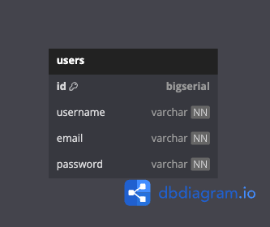

# Real-Time Messaging and AI Chatbot Service

## Project details
This project is a simple real-time messaging and AI chatbot backend application written in Go. The scope of the project
includes:
- a layered-architecture with clear separation of concerns from the data access layer to API endpoints
- a cookie-based JWT implementation for login authentication
- a WebSocket connection for real-time and bi-directional communication between a client and the server
- a handler to process message streaming from the Cohere API

## Database schema

## Tech stack
- Go
- PostgreSQL
- Gin
- Gorilla WebSocket
- Cohere API
- Docker

## References
- [psql tutorial](https://tomcam.github.io/postgres/)
- [Cohere API docs](https://docs.cohere.com/reference/about)